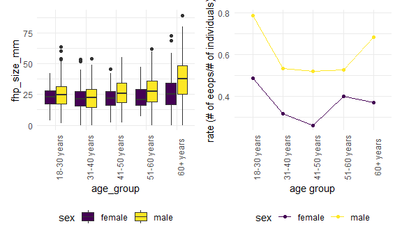
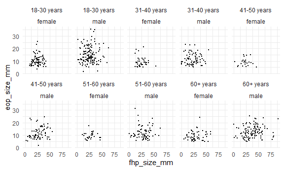
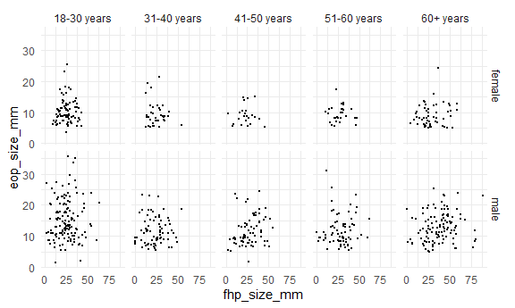

p8105\_mtp\_dtw2127
================
Dee Wang
27/10/2021

## Introduction

## Problem 1

First we will import and clean the data. We will fill in missing values
for eop\_size\_mm with 0s, and convert categorical variables into
character and ordered factors.

``` r
nature_data = read_excel("./data/p8105_mtp_data.xlsx", sheet = "this one", skip = 8) %>%
  janitor::clean_names() %>% 
  mutate(sex = as.factor(sex),
         age_group = as.factor(age_group),
         eop_size = as.factor(eop_size), 
         eop_shape = as.factor(eop_shape),
         fhp_category = as.factor(fhp_category))

nature_data[["eop_size_mm"]][is.na(nature_data[["eop_size_mm"]])] <- 0 

nature_data %>% 
  filter(as.numeric(age_group) > 1) %>% 
  mutate(age_group = recode(age_group,
                            `1` = "<18 yrs",
                            `2` = "18-30 yrs", 
                            `3` = "31-40 yrs",
                            `4` = "41-50 yrs",
                            `5` = "51-60 yrs",
                            `6` = "60+ yrs",
                            `7` = "60+ yrs",
                            `8` = "60+ yrs")) %>%
  mutate(sex = recode(sex, 
                      `0` = "female",
                      `1` = "male")) %>% 
  group_by(age_group, sex) %>%
  summarize(n_obs = n()) %>%
pivot_wider(
  names_from = age_group,
  values_from = n_obs
) 
```

    ## `summarise()` has grouped output by 'age_group'. You can override using the `.groups` argument.

    ## # A tibble: 2 x 6
    ##   sex    `18-30 yrs` `31-40 yrs` `41-50 yrs` `51-60 yrs` `60+ yrs`
    ##   <fct>        <int>       <int>       <int>       <int>     <int>
    ## 1 female         151         102         106          99       155
    ## 2 male           152         102         101         101       150

``` r
#check the recoding
```

Key variables in the dataset include sex and age, EOP size, EOP
visibility classification, EOP shape and FHP size. There are
1221participants included in the dataset. The largest age groups are the
18-30 years old, and 60+ years old age groups. There are roughly equal
number of males and females in each age group, and the number of
individuals in each group is similar for the age groups between 31-80
years of age. There is one participant under 18.

Let’s check to see that the categorical variables were correctly
assigned. First, we will check age.

``` r
nature_data_check = nature_data %>% 
  mutate(correct_age_category = 
           case_when(age < 18 ~ 1,
                     age >= 18 & age <= 30 ~ 2, 
                     age >= 31 & age <= 40 ~ 3, 
                     age >= 41 & age <= 50 ~ 4, 
                     age >= 51 & age <= 60 ~ 5, 
                     age >= 61 & age <= 70 ~ 6, 
                     age >= 71 & age <= 80 ~ 7, 
                     age >= 81 & age <= 90 ~ 8), 
         age_check = ifelse(correct_age_category == age_group, "correct", "incorrect"), 
         correct_size_category = 
           case_when(eop_size_mm < 5 ~ 0, 
                     eop_size_mm >= 5 & eop_size_mm < 10 ~ 1, 
                     eop_size_mm >= 10 & eop_size_mm < 15 ~ 2, 
                     eop_size_mm >= 15 & eop_size_mm < 20 ~ 3,
                     eop_size_mm >= 20 & eop_size_mm <= 25 ~ 4,
                     eop_size_mm >= 25 ~ 5),
         size_check = ifelse(correct_size_category == eop_size, "correct", "incorrect"),
         correct_vis_classification = 
           case_when(eop_size_mm == 0 ~ 0, 
                     eop_size_mm > 0 & eop_size_mm <= 5 ~ 1, 
                     eop_size_mm > 5 ~ 2), 
         vis_check = ifelse(correct_vis_classification == eop_visibility_classification, "correct", "incorrect"),
         correct_fhp_category = 
           case_when(fhp_size_mm < 10 ~ 0,
                     fhp_size_mm >= 10 & fhp_size_mm < 20 ~ 1, 
                     fhp_size_mm >= 21 & fhp_size_mm < 30 ~ 2, 
                     fhp_size_mm >= 31 & fhp_size_mm < 40 ~ 3,
                     fhp_size_mm >= 41 & fhp_size_mm < 50 ~ 4, 
                     fhp_size_mm >= 51 & fhp_size_mm < 60 ~ 5, 
                     fhp_size_mm >= 61 & fhp_size_mm < 70 ~ 6, 
                     fhp_size_mm >= 71 & fhp_size_mm < 80 ~ 7, 
                     fhp_size_mm >= 81 & fhp_size_mm < 90 ~ 8), 
         fhp_check = ifelse(correct_fhp_category == fhp_category, "correct", "incorrect")
         
  ) 

#note to self, check age categories were made correctly 

nature_data_check %>% 
  select(age, age_group, correct_age_category, age_check) %>%
  filter(age_check == "incorrect") 
```

    ## # A tibble: 19 x 4
    ##      age age_group correct_age_category age_check
    ##    <dbl> <fct>                    <dbl> <chr>    
    ##  1    84 7                            8 incorrect
    ##  2    81 7                            8 incorrect
    ##  3    81 7                            8 incorrect
    ##  4    83 7                            8 incorrect
    ##  5    84 7                            8 incorrect
    ##  6    82 7                            8 incorrect
    ##  7    81 7                            8 incorrect
    ##  8    82 7                            8 incorrect
    ##  9    84 7                            8 incorrect
    ## 10    87 7                            8 incorrect
    ## 11    87 7                            8 incorrect
    ## 12    83 7                            8 incorrect
    ## 13    83 7                            8 incorrect
    ## 14    88 7                            8 incorrect
    ## 15    83 7                            8 incorrect
    ## 16    82 7                            8 incorrect
    ## 17    85 7                            8 incorrect
    ## 18    85 7                            8 incorrect
    ## 19    45 1                            4 incorrect

18 participants were incorrectly categorized as belonging to the 71-80
yr age group, when they should have been in the 81-90 yr age group. One
participant was incorrectly categorized as belonging to the &lt; 18 yr
age group, when they should have been categorized as belonging to the
41-50 age group.

Next, let’s check if the eop size categories were correctly assigned.

``` r
nature_size_check = nature_data_check %>% 
  select(eop_size_mm, eop_size, correct_size_category, size_check) %>% 
  filter(size_check == "incorrect")
```

18 participants had incorrect eop size categorizations.

Next, we will check visibility classification.

``` r
nature_data_check %>% 
  select(eop_size_mm, eop_visibility_classification, correct_vis_classification, vis_check) %>% 
  filter(vis_check == "incorrect") 
```

    ## # A tibble: 88 x 4
    ##    eop_size_mm eop_visibility_classification correct_vis_classificati~ vis_check
    ##          <dbl>                         <dbl>                     <dbl> <chr>    
    ##  1         0                               1                         0 incorrect
    ##  2         0                               1                         0 incorrect
    ##  3         0                               1                         0 incorrect
    ##  4         0                               1                         0 incorrect
    ##  5         1.4                             2                         1 incorrect
    ##  6         0                               1                         0 incorrect
    ##  7         0                               1                         0 incorrect
    ##  8         0                               1                         0 incorrect
    ##  9         0                               1                         0 incorrect
    ## 10         0                               2                         0 incorrect
    ## # ... with 78 more rows

88 participants had their visibility classification incorrectly
assigned.

## Problem 2

For Figure 3, a boxplot might be more appropriate. We will re-categorize
age groups 7 and 8 as 6, since we will be grouping observations from
these three age groups.

``` r
nature_data_age = nature_data %>% 
  filter(as.numeric(age_group) > 1) %>% 
  mutate(age_group = recode(age_group, 
                            `2` = "18-30 years", 
                            `3` = "31-40 years",
                            `4` = "41-50 years", 
                            `5` = "51-60 years",
                            `6` = "60+ years",
                            `7` = "60+ years", 
                            `8` = "60+ years"), 
         sex = recode(sex, 
                      `0` = "female", 
                      `1` = "male")
         ) 

figure_3 = ggplot(nature_data_age, aes(x = age_group, y = fhp_size_mm, fill = sex)) +
  geom_boxplot() + 
  theme(axis.text.x = element_text(angle = 90)) 
```

For Figure 4, we’d like to look at rates of enlarged EOP, instead of
numbers with enlarged EOP. We will define the rate as number of enlarged
EOP/number of individuals with an EOP size measurement.

``` r
#figure out how many individuals are in each age + sex group 

nature_data_age_n = nature_data_age %>% 
  filter(eop_size_mm > 0) %>% 
  group_by(age_group, sex) %>% 
  summarize(n_sex_age = n()) 
```

    ## `summarise()` has grouped output by 'age_group'. You can override using the `.groups` argument.

``` r
nature_data_eop_n = nature_data_age %>% 
  filter(as.numeric(eop_size) >= 3) %>%
  group_by(age_group, sex) %>% 
  summarize(n_eeop = n()) 
```

    ## `summarise()` has grouped output by 'age_group'. You can override using the `.groups` argument.

``` r
nature_data_combined = 
  left_join(nature_data_age_n, nature_data_eop_n) %>% 
  mutate(rate = n_eeop/n_sex_age)
```

    ## Joining, by = c("age_group", "sex")

``` r
figure_4 = 
  nature_data_combined %>% 
  ggplot(aes(x = age_group, y = rate, color = sex)) + 
  geom_line(aes(group = sex)) + 
  geom_point() + 
  theme(axis.text.x = element_text(angle = 90)) +
  labs(x = "age group", y = "rate (# of eeops/# of individuals)")

(figure_3 + figure_4)
```

    ## Warning: Removed 6 rows containing non-finite values (stat_boxplot).



Now, we will work on creating a 2x5 panel figure which shows the
association between FHP size + EOP size in each age and sex group.

``` r
nature_data_age %>% 
  filter(eop_size_mm > 0) %>% 
  ggplot(aes(x = fhp_size_mm, y = eop_size_mm)) +
  geom_point(size = .3) + 
  labs() + 
  facet_wrap(~age_group + sex, ncol = 5)
```

    ## Warning: Removed 5 rows containing missing values (geom_point).



``` r
nature_data_age %>% 
  filter(eop_size_mm > 0) %>% 
  ggplot(aes(x = fhp_size_mm, y = eop_size_mm)) +
  geom_point(size = .3) + 
  labs() + 
  facet_grid(sex ~ age_group)
```

    ## Warning: Removed 5 rows containing missing values (geom_point).



## Problem 3

We will determine sample size of each age group and compare this with
the authors’ calculations.

``` r
nature_data_age %>% 
  count(age_group, name = "n_age_group")
```

    ## # A tibble: 5 x 2
    ##   age_group   n_age_group
    ##   <fct>             <int>
    ## 1 18-30 years         303
    ## 2 31-40 years         204
    ## 3 41-50 years         207
    ## 4 51-60 years         200
    ## 5 60+ years           305

The sample sizes we determined are similar to the sample sizes
determined by the authors. The authors underestimated number of
participants for all age groups except for the 41-50 year age group
which they accurately determined.

Let’s calculate the mean and standard deviations for FHP size.

``` r
nature_data %>% 
  group_by(sex) %>% 
  summarize(mean_fhp = mean(fhp_size_mm, na.rm = TRUE), 
            sd_fhp = sd(fhp_size_mm, na.rm = TRUE))
```

    ## # A tibble: 2 x 3
    ##   sex   mean_fhp sd_fhp
    ##   <fct>    <dbl>  <dbl>
    ## 1 0         23.7   10.6
    ## 2 1         28.5   14.7

Authors’ calculation of mean and standard deviations for FHP size are
consistent with our calculations.

The definition of EEOP is an EOP size greater than 10 mm. We can use the
eop\_size or eop\_size\_mm variables to determine if the authors
prevalence calculation of 33% is accurate.

``` r
nature_data %>%
  filter(as.numeric(eop_size) >= 2) %>% 
  nrow()
```

    ## [1] 699

``` r
#why is there a discrepancy when using eop_size vs eop_size_mm? 

eeop_n = nature_data_check %>%
  filter(as.numeric(correct_size_category) >= 2) %>% 
  nrow()

nature_data %>%
  filter(as.numeric(eop_size_mm) >= 10) %>% 
  nrow()
```

    ## [1] 393

``` r
study_pop_n = nrow(nature_data)

study_pop_no_missing_n = nature_data %>% 
  filter(eop_size_mm > 0) %>%
  nrow()

#what to do w missing values?
```

The prevalence we calculate is 0.3218673 with missing values included,
and 0.5598291 if excluding missing values. If we include participants
with a missing eop\_size\_mm value in our calculation, we get a similar
prevalence as calculated by the authors.

Next, let’s check if the FHP trends noted by the authors are consistent
with our data.

Let’s see how frequently FHP &gt; 40 mm is observed in each age group.

``` r
nature_data_age_n = nature_data_age %>%
  group_by(age_group) %>% 
  summarize(n_age_group = n())

nature_data_fhp_over40_n = nature_data_age %>%
  filter(fhp_size_mm > 40) %>%
  group_by(age_group) %>% 
  summarize(n_over40 = n())
  
table = left_join(nature_data_age_n, nature_data_fhp_over40_n) %>% 
  mutate(prevalence = n_over40/n_age_group*100)
```

    ## Joining, by = "age_group"

``` r
print(table)
```

    ## # A tibble: 5 x 4
    ##   age_group   n_age_group n_over40 prevalence
    ##   <fct>             <int>    <int>      <dbl>
    ## 1 18-30 years         303       20       6.60
    ## 2 31-40 years         204       12       5.88
    ## 3 41-50 years         207       18       8.70
    ## 4 51-60 years         200       22      11   
    ## 5 60+ years           305       99      32.5

The prevalence of FHP does appear to be highest in the 60+ years group.
