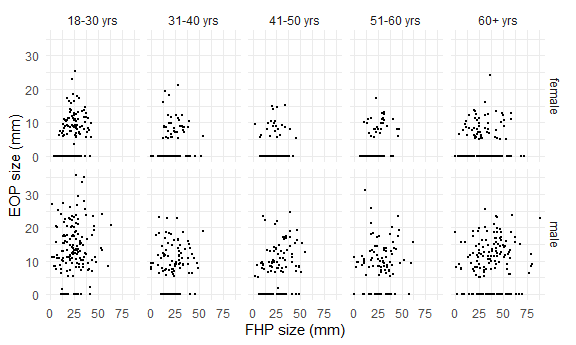

p8105\_mtp\_dtw2127
================
Dee Wang
27/10/2021

## Introduction

We examine findings on the relationship between posture, as measured by
degree of forward head protraction (FHP), and enlarged external
occipital protuberances (EOP). We examine data consistency, results
presentation and try and reproduce results.

## Problem 1 - Data

We fill in missing values for eop\_size\_mm with 0s, convert categorical
variables into character and ordered factors, and recode age\_group and
sex according to header information.

``` r
nature_data = read_excel("./data/p8105_mtp_data.xlsx", sheet = "this one", skip = 8) %>%
  janitor::clean_names() %>% 
  mutate(sex = as.factor(sex),
         age_group = as.factor(age_group),
         eop_size = as.factor(eop_size), 
         eop_shape = as.factor(eop_shape),
         fhp_category = as.factor(fhp_category))

#replace missing values in eop_size_mm column with 0s'
nature_data[["eop_size_mm"]][is.na(nature_data[["eop_size_mm"]])] <- 0 

nature_data = nature_data %>%
  filter(as.numeric(age_group) > 1) %>% #filter out age_group 1
  mutate(age_group = recode(age_group,
                            `2` = "18-30 yrs", 
                            `3` = "31-40 yrs",
                            `4` = "41-50 yrs",
                            `5` = "51-60 yrs",
                            `6` = "60+ yrs",
                            `7` = "60+ yrs",
                            `8` = "60+ yrs")) %>%
  mutate(sex = recode(sex, 
                      `0` = "female",
                      `1` = "male")) 
```

Key variables include sex and age, eop\_size,
eop\_visibility\_classification, eop\_shape and fhp\_size. There are
1219 participants in the dataset.

``` r
  nature_data %>% 
    group_by(age_group, sex) %>%
  summarize(n_obs = n()) %>%
pivot_wider(
  names_from = age_group,
  values_from = n_obs)
```

    ## `summarise()` has grouped output by 'age_group'. You can override using the `.groups` argument.

    ## # A tibble: 2 x 6
    ##   sex    `18-30 yrs` `31-40 yrs` `41-50 yrs` `51-60 yrs` `60+ yrs`
    ##   <fct>        <int>       <int>       <int>       <int>     <int>
    ## 1 female         151         102         106          99       155
    ## 2 male           152         102         101         101       150

The 18-30, and 60+ years old are the largest age groups. There are
roughly equal numbers of males and females.

We’ll check categorical variable assignment.

``` r
nature_data_check = nature_data %>% 
  mutate(correct_age_category = 
           case_when(age >= 18 & age <= 30 ~ "18-30 yrs", 
                     age >= 31 & age <= 40 ~ "31-40 yrs", 
                     age >= 41 & age <= 50 ~ "41-50 yrs", 
                     age >= 51 & age <= 60 ~ "51-60 yrs", 
                     age >= 61 ~ "60+ yrs"), 
         age_check = ifelse(correct_age_category == age_group, "consistent", "inconsistent"), 
         correct_size_category = 
           case_when(eop_size_mm < 5 ~ 0, 
                     eop_size_mm >= 5 & eop_size_mm < 10 ~ 1, 
                     eop_size_mm >= 10 & eop_size_mm < 15 ~ 2, 
                     eop_size_mm >= 15 & eop_size_mm < 20 ~ 3,
                     eop_size_mm >= 20 & eop_size_mm < 25 ~ 4,
                     eop_size_mm >= 25 ~ 5),
         size_check = ifelse(correct_size_category == eop_size, "consistent", "inconsistent"),
         correct_vis_class = 
           case_when(eop_size_mm == 0 ~ 0, 
                     eop_size_mm > 0 & eop_size_mm <= 5 ~ 1, 
                     eop_size_mm > 5 ~ 2), 
         vis_check = ifelse(correct_vis_class == eop_visibility_classification, "consistent", "inconsistent"),
         correct_fhp_category = 
           case_when(fhp_size_mm < 10 ~ 0,
                     fhp_size_mm >= 10 & fhp_size_mm < 20 ~ 1, 
                     fhp_size_mm >= 20 & fhp_size_mm < 30 ~ 2, 
                     fhp_size_mm >= 30 & fhp_size_mm < 40 ~ 3,
                     fhp_size_mm >= 40 & fhp_size_mm < 50 ~ 4, 
                     fhp_size_mm >= 50 & fhp_size_mm < 60 ~ 5, 
                     fhp_size_mm >= 60 & fhp_size_mm < 70 ~ 6, 
                     fhp_size_mm >= 70 & fhp_size_mm < 80 ~ 7, 
                     fhp_size_mm >= 80 & fhp_size_mm < 90 ~ 8), 
         fhp_check = ifelse(correct_fhp_category == fhp_category, "consistent", "inconsistent")
         )
```

``` r
nature_data_check %>% 
  select(age, age_group, correct_age_category, age_check) %>%
  filter(age_check == "inconsistent")
```

    ## # A tibble: 0 x 4
    ## # ... with 4 variables: age <dbl>, age_group <fct>, correct_age_category <chr>,
    ## #   age_check <chr>

Age groups were correctly assigned.

``` r
nature_data_check %>% 
  select(eop_size_mm, eop_size, correct_size_category, size_check) %>% 
  filter(size_check == "inconsistent")
```

    ## # A tibble: 18 x 4
    ##    eop_size_mm eop_size correct_size_category size_check  
    ##          <dbl> <fct>                    <dbl> <chr>       
    ##  1       33.5  4                            5 inconsistent
    ##  2       25.5  4                            5 inconsistent
    ##  3       35    4                            5 inconsistent
    ##  4       29.5  4                            5 inconsistent
    ##  5        2.11 4                            0 inconsistent
    ##  6       20    3                            4 inconsistent
    ##  7       31.1  4                            5 inconsistent
    ##  8        5    0                            1 inconsistent
    ##  9       35.7  4                            5 inconsistent
    ## 10       20    3                            4 inconsistent
    ## 11       25.4  4                            5 inconsistent
    ## 12       26.8  4                            5 inconsistent
    ## 13       23.5  5                            4 inconsistent
    ## 14       22.9  5                            4 inconsistent
    ## 15        0    1                            0 inconsistent
    ## 16       15    14.6                         3 inconsistent
    ## 17       14.6  3                            2 inconsistent
    ## 18       12.1  3                            2 inconsistent

18 participants had incorrect EOP size categorizations. Many
participants were assigned EOP size 4 instead of 5.

``` r
nature_data_check %>% 
  select(eop_size_mm, eop_visibility_classification, correct_vis_class, vis_check) %>% 
  filter(vis_check == "inconsistent") 
```

    ## # A tibble: 88 x 4
    ##    eop_size_mm eop_visibility_classification correct_vis_class vis_check   
    ##          <dbl>                         <dbl>             <dbl> <chr>       
    ##  1         0                               1                 0 inconsistent
    ##  2         0                               1                 0 inconsistent
    ##  3         0                               1                 0 inconsistent
    ##  4         0                               1                 0 inconsistent
    ##  5         1.4                             2                 1 inconsistent
    ##  6         0                               1                 0 inconsistent
    ##  7         0                               1                 0 inconsistent
    ##  8         0                               1                 0 inconsistent
    ##  9         0                               1                 0 inconsistent
    ## 10         0                               2                 0 inconsistent
    ## # ... with 78 more rows

88 participants had visibility classification incorrectly assigned. Many
participants were categorized as EOP size 0 instead of 1.

``` r
nature_data_check %>% 
  select(fhp_size_mm, fhp_category, correct_fhp_category, fhp_check) %>%
  filter(fhp_check == "inconsistent") 
```

    ## # A tibble: 27 x 4
    ##    fhp_size_mm fhp_category correct_fhp_category fhp_check   
    ##          <dbl> <fct>                       <dbl> <chr>       
    ##  1        54.1 4                               5 inconsistent
    ##  2        63.6 4                               6 inconsistent
    ##  3        54.9 4                               5 inconsistent
    ##  4        80.2 4                               8 inconsistent
    ##  5        54.9 4                               5 inconsistent
    ##  6        52.7 4                               5 inconsistent
    ##  7        52.1 4                               5 inconsistent
    ##  8        54.7 4                               5 inconsistent
    ##  9        53.2 4                               5 inconsistent
    ## 10        89.3 4                               8 inconsistent
    ## # ... with 17 more rows

27 participants had an incorrect FHP categorization (FHP category
underestimated).

Number of data inconsistencies is minimal so we’ll leave this data in.

## Problem 2 - Visualization

``` r
figure_3 = ggplot(nature_data,
                  aes(x = age_group, y = fhp_size_mm, fill = sex)) +
  geom_boxplot() + 
  theme(axis.text.x = element_text(angle = 90)) + 
  labs(x = "age group", y = "FHP size (mm)")
```

``` r
#figure out how many participants are in each age + sex group
nature_data_age_n = nature_data %>% 
  group_by(age_group, sex) %>% 
  summarize(n_sex_age = n())
```

    ## `summarise()` has grouped output by 'age_group'. You can override using the `.groups` argument.

``` r
#figure out how many participants within each age+sex group have EEOP.
nature_data_eop_n = nature_data %>% 
  filter(eop_size_mm >= 10) %>%
  group_by(age_group, sex) %>% 
  summarize(n_eeop = n()) 
```

    ## `summarise()` has grouped output by 'age_group'. You can override using the `.groups` argument.

``` r
nature_data_combined = 
  left_join(nature_data_age_n, nature_data_eop_n) %>% 
  mutate(rate = n_eeop/n_sex_age) %>% 
  mutate(rate = round(rate, 2))
```

    ## Joining, by = c("age_group", "sex")

``` r
figure_4 = 
  nature_data_combined %>% 
  ggplot(aes(x = age_group, y = rate, color = sex)) + 
  geom_line(aes(group = sex)) + 
  geom_point() + 
  theme(axis.text.x = element_text(angle = 90)) +
  labs(x = "age group", y = "EEOP rate")

(figure_3 + figure_4)
```

    ## Warning: Removed 6 rows containing non-finite values (stat_boxplot).


From the right panel, We can see a higher rate of EEOP in males. Highest
EEOP rates are in the youngest age group. If FHP is predictive of EEOP,
we would expect the FHP size trend on the left to be similar to the EEOP
rate trend (ex. highest FHP size values for 18-30 years), but this isn’t
the case. FHP sizes appear to be larger in males than in females, but it
isn’t clear if differences are significant.

``` r
nature_data %>% 
  ggplot(aes(x = fhp_size_mm, y = eop_size_mm)) +
  geom_point(size = .3) + 
  labs() + 
  facet_grid(sex ~ age_group) + 
  labs(x = "FHP size (mm)", y = "EOP size (mm)")
```

    ## Warning: Removed 6 rows containing missing values (geom_point).



There’s no association between EOP size and FHP size in any of the age
and sex groups. Plots don’t provide evidence that FHP is predictive of
EOP.

## Problem 3 - Reproducing reported results

We’ll try reproducing some reported results.

``` r
nature_data %>% 
  count(age_group, name = "n_age_group")
```

    ## # A tibble: 5 x 2
    ##   age_group n_age_group
    ##   <fct>           <int>
    ## 1 18-30 yrs         303
    ## 2 31-40 yrs         204
    ## 3 41-50 yrs         207
    ## 4 51-60 yrs         200
    ## 5 60+ yrs           305

Sample sizes calculated are similar to authors’ calculations
(differences within 7).

``` r
nature_data %>% 
  group_by(sex) %>% 
  summarize(mean_fhp = mean(fhp_size_mm, na.rm = TRUE), 
            sd_fhp = sd(fhp_size_mm, na.rm = TRUE)) %>%
  mutate(mean_fhp = round(mean_fhp, digits = 2), 
         sd_fhp = round(sd_fhp, digits = 2))
```

    ## # A tibble: 2 x 3
    ##   sex    mean_fhp sd_fhp
    ##   <fct>     <dbl>  <dbl>
    ## 1 female     23.7   10.6
    ## 2 male       28.5   14.7

Authors’ calculation of mean and standard deviations for FHP size are
consistent with our calculations.

The definition of EEOP is an EOP size &gt; 10 mm. We’ll use the EOP size
variable to check the EEOP prevalence calculation.

``` r
eeop_n = nature_data %>%
  filter(as.numeric(eop_size_mm) >= 10) %>% 
  nrow()

study_pop_n = nrow(nature_data)
```

The prevalence we calculate (32.24)% is similar to the authors’
calculations, but about 1% off.

``` r
nature_data_age_n = nature_data %>%
  group_by(age_group) %>% 
  summarize(n_age_group = n())

nature_data_fhp_over40_n = nature_data %>%
  filter(fhp_size_mm > 40) %>%
  group_by(age_group) %>% 
  summarize(n_over40 = n())
  
table = left_join(nature_data_age_n, nature_data_fhp_over40_n) %>% 
  mutate(prevalence = n_over40/n_age_group*100) %>% 
  mutate(prevalence = round(prevalence, 2))
```

    ## Joining, by = "age_group"

``` r
print(table)
```

    ## # A tibble: 5 x 4
    ##   age_group n_age_group n_over40 prevalence
    ##   <fct>           <int>    <int>      <dbl>
    ## 1 18-30 yrs         303       20       6.6 
    ## 2 31-40 yrs         204       12       5.88
    ## 3 41-50 yrs         207       18       8.7 
    ## 4 51-60 yrs         200       22      11   
    ## 5 60+ yrs           305       99      32.5

Prevalence of FHP over 40 mm is higher in older age groups and highest
in the 60+ years group which is consistent with authors’ observations.
Our prevalence calculation for 60+ years is different by about 2%.

## Problem 4 - Discussion

There are issues with the data analyses and result presentation. Some
categorizations did not match data header information. Figures were also
misleading, especially Figure 4. We calculated similar results as
reported in the paper, but couldn’t get the exact calculations.

We cannot conclude that cell phones are causing horn growth. We’d need
to see data on cell phone usage, and evidence that screen-based activity
impacts FHP size. A regression analysis to look at the association
between FHP and EOP, adjusting for potential confounders would be
useful.

### Word count

``` r
wordcountaddin::text_stats("p8105_mtp_dtw2127.Rmd")
```

    ## For information on available language packages for 'koRpus', run
    ## 
    ##   available.koRpus.lang()
    ## 
    ## and see ?install.koRpus.lang()

    ## 
    ## Attaching package: 'koRpus'

    ## The following object is masked from 'package:readr':
    ## 
    ##     tokenize

| Method          | koRpus      | stringi       |
|:----------------|:------------|:--------------|
| Word count      | 499         | 474           |
| Character count | 3075        | 3075          |
| Sentence count  | 37          | Not available |
| Reading time    | 2.5 minutes | 2.4 minutes   |
