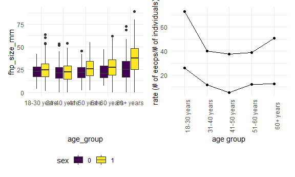

p8105\_mtp\_dtw2127
================
Dee Wang
27/10/2021

## Introduction

## Problem 1

First we will import and clean the data. We will fill in missing values
for eop\_size\_mm with 0s, and convert categorical variables into
character and ordered factors.

``` r
nature_data = read_excel("./data/p8105_mtp_data.xlsx", sheet = "this one", skip = 8) %>%
  janitor::clean_names() %>% 
  mutate(sex = as.factor(sex),
         age_group = as.factor(age_group),
         eop_size = as.factor(eop_size), 
         eop_shape = as.factor(eop_shape),
         fhp_category = as.factor(fhp_category))

nature_data[["eop_size_mm"]][is.na(nature_data[["eop_size_mm"]])] <- 0 

nature_data %>% 
  mutate(age_group = recode(age_group,
                            `1` = "<18 yrs",
                            `2` = "18-30 yrs", 
                            `3` = "31-40 yrs",
                            `4` = "41-50 yrs",
                            `5` = "51-60 yrs",
                            `6` = "61-70 yrs",
                            `7` = "71-80 yrs",
                            `8` = "81-90 yrs")) %>%
  mutate(sex = recode(sex, 
                      `0` = "female",
                      `1` = "male")) %>% 
  group_by(age_group, sex) %>%
  summarize(n_obs = n()) %>%
pivot_wider(
  names_from = age_group,
  values_from = n_obs
) 
```

    ## `summarise()` has grouped output by 'age_group'. You can override using the `.groups` argument.

    ## # A tibble: 2 x 9
    ##   sex    `<18 yrs` `18-30 yrs` `31-40 yrs` `41-50 yrs` `51-60 yrs` `61-70 yrs`
    ##   <fct>      <int>       <int>       <int>       <int>       <int>       <int>
    ## 1 female         1         151         102         106          99          89
    ## 2 male           1         152         102         101         101          89
    ## # ... with 2 more variables: 71-80 yrs <int>, 81-90 yrs <int>

``` r
#check the recoding
```

Key variables in the dataset include sex and age, EOP size, EOP
visibility classification, EOP shape and FHP size. There are
1221participants included in the dataset. The largest age group is 18-30
years old, and the smallest age groups are &lt; 18 years and 81-90
years. There are roughly equal number of males and females in each age
group, and the number of individuals in each group is similar for the
age groups between 31-80 years of age.

Let’s check to see that the categorical variables were correctly
assigned.

``` r
nature_data_check = nature_data %>% 
  mutate(correct_age_category = 
           case_when(age < 18 ~ 1,
                     age >= 18 & age <= 30 ~ 2, 
                     age >= 31 & age <= 40 ~ 3, 
                     age >= 41 & age <= 50 ~ 4, 
                     age >= 51 & age <= 60 ~ 5, 
                     age >= 61 & age <= 70 ~ 6, 
                     age >= 71 & age <= 80 ~ 7, 
                     age >= 81 & age <= 90 ~ 8), 
         age_check = ifelse(correct_age_category == age_group, "correct", "incorrect"), 
         correct_size_category = 
           case_when(eop_size_mm < 5 ~ 0, 
                     eop_size_mm >= 5 & eop_size_mm < 10 ~ 1, 
                     eop_size_mm >= 10 & eop_size_mm < 15 ~ 2, 
                     eop_size_mm >= 15 & eop_size_mm < 20 ~ 3,
                     eop_size_mm >= 20 & eop_size_mm <= 25 ~ 4,
                     eop_size_mm >= 25 ~ 5)
  ) 

#note to self, check age categories were made correctly 

nature_data_check %>% 
  filter(age_check == "incorrect") %>% 
  knitr::kable()
```

| sex | age | age\_group | eop\_size\_mm | eop\_size | eop\_visibility\_classification | eop\_shape | fhp\_size\_mm | fhp\_category | correct\_age\_category | age\_check | correct\_size\_category |
|:----|----:|:-----------|--------------:|:----------|--------------------------------:|:-----------|--------------:|:--------------|-----------------------:|:-----------|------------------------:|
| 1   |  84 | 7          |           9.0 | 1         |                               2 | 2          |          80.2 | 4             |                      8 | incorrect  |                       1 |
| 0   |  81 | 7          |           0.0 | 0         |                               0 | NA         |          47.1 | 4             |                      8 | incorrect  |                       0 |
| 0   |  81 | 7          |           0.0 | 0         |                               1 | NA         |          16.8 | 1             |                      8 | incorrect  |                       0 |
| 1   |  83 | 7          |           7.6 | 1         |                               2 | 1          |          32.3 | 3             |                      8 | incorrect  |                       1 |
| 1   |  84 | 7          |           0.0 | 0         |                               0 | NA         |          46.8 | 4             |                      8 | incorrect  |                       0 |
| 0   |  82 | 7          |           5.4 | 1         |                               2 | 1          |          27.5 | 2             |                      8 | incorrect  |                       1 |
| 0   |  81 | 7          |           0.0 | 0         |                               0 | NA         |          15.3 | 1             |                      8 | incorrect  |                       0 |
| 1   |  82 | 7          |          12.8 | 2         |                               2 | 3          |          42.9 | 4             |                      8 | incorrect  |                       2 |
| 0   |  84 | 7          |          12.7 | 2         |                               2 | 1          |          58.2 | 5             |                      8 | incorrect  |                       2 |
| 1   |  87 | 7          |           8.3 | 1         |                               2 | 1          |          79.9 | 7             |                      8 | incorrect  |                       1 |
| 0   |  87 | 7          |           0.0 | 0         |                               0 | NA         |          34.8 | 3             |                      8 | incorrect  |                       0 |
| 1   |  83 | 7          |          10.7 | 2         |                               2 | 3          |          57.3 | 5             |                      8 | incorrect  |                       2 |
| 0   |  83 | 7          |           0.0 | 0         |                               0 | NA         |          72.8 | 7             |                      8 | incorrect  |                       0 |
| 1   |  88 | 7          |          23.0 | 4         |                               2 | 3          |          44.5 | 4             |                      8 | incorrect  |                       4 |
| 1   |  83 | 7          |          15.5 | 3         |                               2 | 3          |          62.5 | 6             |                      8 | incorrect  |                       3 |
| 0   |  82 | 7          |           6.7 | 1         |                               2 | 1          |          35.3 | 3             |                      8 | incorrect  |                       1 |
| 1   |  85 | 7          |          11.9 | 2         |                               2 | 1          |          79.6 | 7             |                      8 | incorrect  |                       2 |
| 0   |  85 | 7          |           9.8 | 1         |                               2 | 1          |          35.1 | 3             |                      8 | incorrect  |                       1 |
| 1   |  45 | 1          |           0.0 | 0         |                               0 | NA         |          42.0 | 4             |                      4 | incorrect  |                       0 |

## Problem 2

For Figure 3, a boxplot might be more appropriate. We will re-categorize
age groups 7 and 8 as 6, since we will be grouping observations from
these three age groups.

``` r
nature_data_age = nature_data %>% 
  filter(as.numeric(age_group) > 1) %>% 
  mutate(age_group = recode(age_group, 
                            `2` = "18-30 years", 
                            `3` = "31-40 years",
                            `4` = "41-50 years", 
                            `5` = "51-60 years",
                            `6` = "60+ years",
                            `7` = "60+ years", 
                            `8` = "60+ years")
         ) 

figure_3 = ggplot(nature_data_age, aes(x = age_group, y = fhp_size_mm, fill = sex)) + geom_boxplot()
```

For Figure 4, we’d like to look at rates of enlarged EOP, instead of
numbers with enlarged EOP.

``` r
#figure out how many individuals are in each age + sex group 

nature_data_age_n = nature_data_age %>% 
  group_by(age_group, sex) %>% 
  summarize(n_obs = n())
```

    ## `summarise()` has grouped output by 'age_group'. You can override using the `.groups` argument.

``` r
nature_data_eop_n = nature_data_age %>% 
  filter(as.numeric(eop_size) >= 3) %>%
  group_by(age_group, sex) %>% 
  summarize(n_obs = n())
```

    ## `summarise()` has grouped output by 'age_group'. You can override using the `.groups` argument.

``` r
nature_data_combined = cbind(nature_data_age_n, nature_data_eop_n) %>%
  mutate(rate = n_obs...6 * 100 / n_obs...3)
```

    ## New names:
    ## * age_group -> age_group...1
    ## * sex -> sex...2
    ## * n_obs -> n_obs...3
    ## * age_group -> age_group...4
    ## * sex -> sex...5
    ## * ...

``` r
figure_4 = 
  nature_data_combined %>% 
  ggplot(aes(x = age_group...4, y = rate)) + 
  geom_line(aes(group = sex...2)) + 
  geom_point() + 
  theme(axis.text.x = element_text(angle = 90)) +
  labs(x = "age group", y = "rate (# of eeops/# of individuals)")

(figure_3 + figure_4)
```

    ## Warning: Removed 6 rows containing non-finite values (stat_boxplot).


